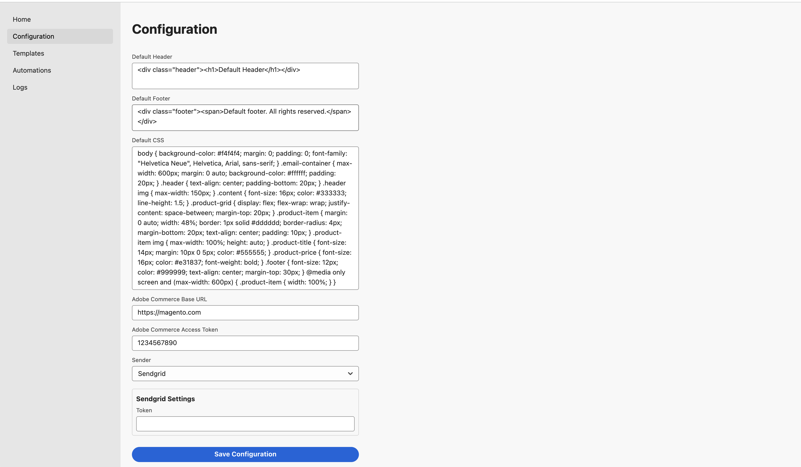
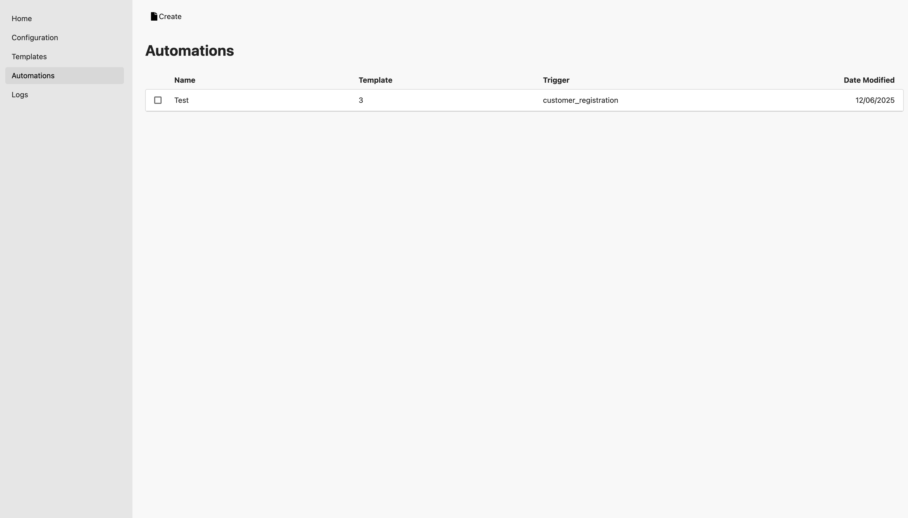
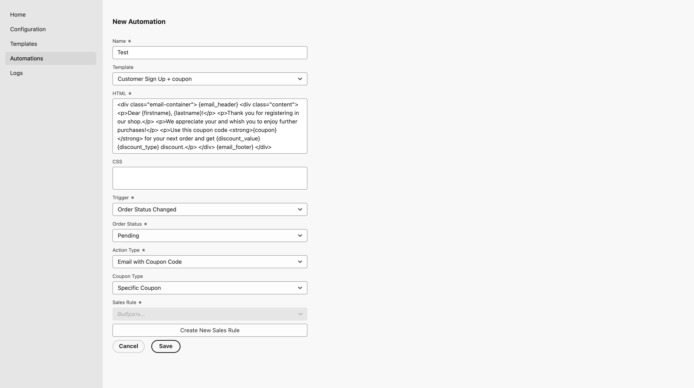
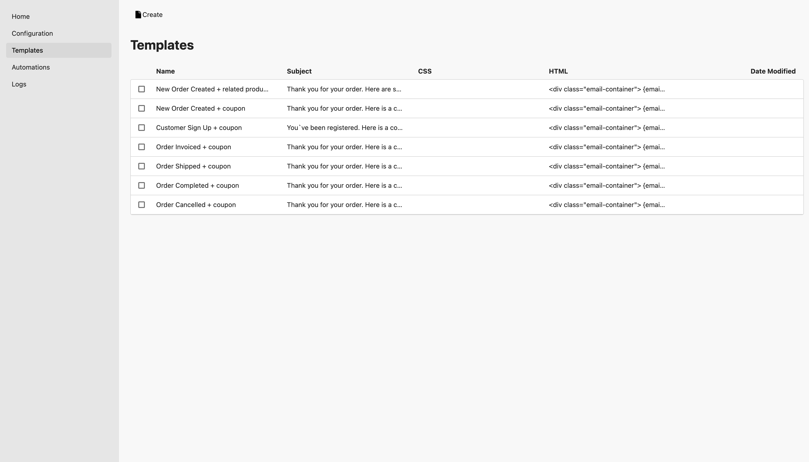
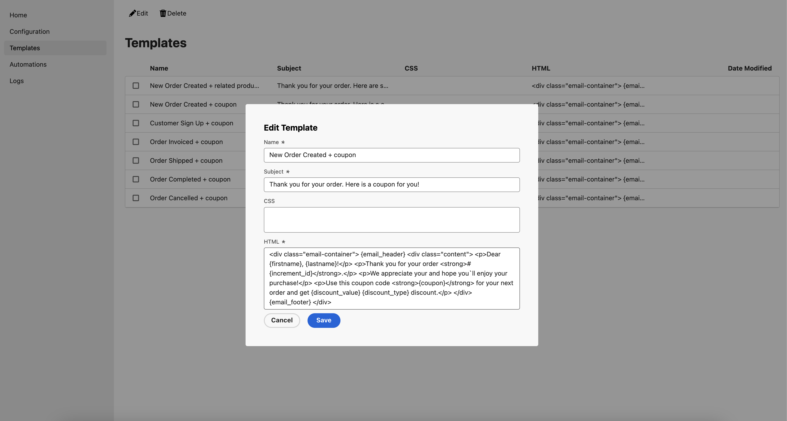
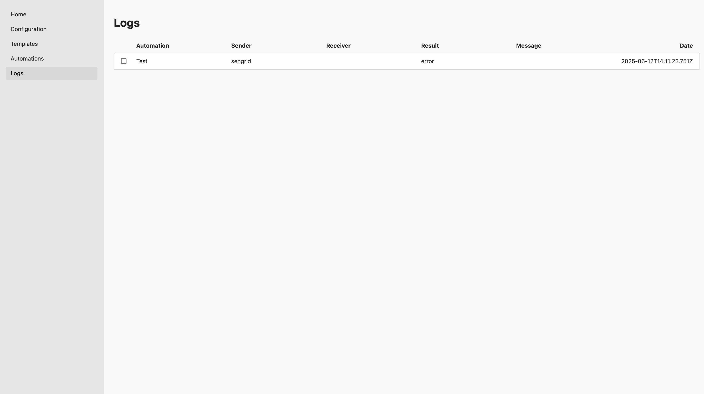

# Adobe Commerce Microservice for transactional emails sending

## Table of Contents
- [Overview](#overview)
- [Prerequisites](#prerequisites)
  - [Download and unpack App Builder package](#download-and-unpack-app-builder-package)
  - [Create Adobe App Builder Project](#create-adobe-app-builder-project)
  - [Configure a New Integration in Adobe Commerce](#configure-a-new-integration-in-adobe-commerce)
  - [Install Commerce Eventing Module](#install-commerce-eventing-module)
  - [Subscribe an Adobe Commerce instance to Events](#subscribe-an-adobe-commerce-instance-to-events)
  - [Configure the Adobe I/O Runtime](#configure-the-adobe-io-runtime)
- [Application Deployment and Onboarding](#application-deployment-and-onboarding)
    - [Configure the Project](#configure-the-project)
    - [Deploy the Application](#deploy-the-application)
    - [Onboarding](#onboarding)
    - [Template usage](#template-usage)
    - [Logs usage](#logs-usage)
    - [Placeholder usage](#placeholder-usage)
    - [Notes](#notes)
---

## Overview

This project is a microservice for sending transactional emails for Adobe Commerce. 
It is built using the Adobe I/O App Builder technology.
Extension allows to extend the standard transactional emails functionality of Adobe Commerce.
Among the functionality is the ability to send the emails with a dynamic coupon codes, 
sendgrid integration and SMTP.

---

## Prerequisites

### Download and unpack App Builder package
1. Perform a git checkout operation, or download a zip package and unpack it.
2. Navigate to the project directory where you`ve unpacked a package.

### Create Adobe App Builder Project
Create a new App Builder project in Adobe Developer Console

### Configure a New Integration in Adobe Commerce
1. In the Adobe Commerce Admin, navigate to **System > Extensions > Integrations**.
2. Click **Add New Integration**:
- Enter a name for the integration.
- On the left, select **API** and grant access to all resources.
  
  
3. Save the integration and activate it.
4. Note down the integration credentials (access token).

### Install Commerce Eventing Module
For Adobe Commerce versions 2.4.*, install the **Adobe I/O Events for Adobe Commerce** module following [this documentation](https://developer.adobe.com/commerce/extensibility/events/installation).

### Subscribe an Adobe Commerce instance to Events
Subscribe to the following events using ssh interface for your Adobe Commerce instance:
    ```bash
    bin/magento events:subscribe --fields customer.id --fields customer.email observer.customer_register_success
    bin/magento events:subscribe --fields=* observer.sales_order_save_after
    ```

### Configure the Adobe I/O Runtime
On the https://developer.adobe.com/console, navigate to your project and configure the events registration.
1. Select the environment.
2. Click "Add Service" and choose "Event".
3. Select "Commerce Events" and click "Next".
4. Select the event provider which is set in the Adobe Commerce instance.
5. Select the "Observer event_sales_order_save_after" and click "Next".
6. Enter Event Registration details like "Event registration name" and "Event registration description" and click "Next".
7. Select the "EngageEmails/trigger-order-status-changed" action among the "Runtime action" and click "Save configured events".
8. Performs the steps 3-7 for the "Observer event_customer_register_success" and select the "EngageEmails/trigger-customer-registration" action.

## Application Deployment and Onboarding

### Configure the Project
1. Navigate to the project directory.
2. Install npm dependencies:
   ```bash
   npm install
   ```
3. Connect to the Adobe App Builder:
   ```bash
   aio login
   aio console org select
   aio console project select
   aio console workspace select
   ```

### Deploy the Application
1. Deploy the project runtime actions:
   ```bash
   aio app deploy
   ```

### Onboarding

1. Go to the ***Configuration*** page and fill the following fields:
    - Default Header. Html code, which will be added to the header of the email by default.
    - Default Footer. Html code, which will be added to the footer of the email by default.
    - Default CSS. The CSS code, which will be added to the email by default.
    - Magento Base URL. The base URL of the Adobe Commerce instance.
    - Magento Access Token. The access token, which you`ve written when you set up an Intergation in Adobe Commerce.
    - Sender. Choose among the Sendgrid and SMTP providers. In case of choosing each of them, you need to fill the following fields:
        - Sendgrid:
            - Token. The API key of the Sendgrid account.
        - SMTP:
            - Host. The host of the SMTP server.
            - Port. The port of the SMTP server.
            - Username. The username of the SMTP server.
            - Password. The password of the SMTP server.
            - From Email. The email address, which will be used as a sender.
2. Click 'Save Configuration' button.
3. Go to the **Automations** page and create a new automation. 


    Among the fields, you could/have to fields:
    - Name. The name of the automation.
    - Template. The email template, which will be used for the automation. You could also copy the html/css from that 
      Template to the Automation. The html will be used from the Automation settings with priority. If Automation html 
      is empty, the html from the Template is used.
    - CSS. Same logic for the html. However, if the css in Automation and Template are empty, the default css from the 
      configuration is used.
    - Trigger. The event, which will trigger the automation. They are: Order Status Changed and Customer Sign Up.
      - if the Order Status Changed is choosen, you should additionally choose the order status, which will trigger the automation.
      You are able to choose among the existing order statuses in the Adobe Commerce instance, or create a new one.
    - Action Type. The action type, which will be used for the automation. They are:
        - Email with Coupon Code. Here you could choose among the existed coupons in the Adobe Commerce instance, or create a new one.
        - Email with X Related Products. Here you could choose the max number of related products, which will be sent in the email.
4. Click 'Save Automation' button.

### Template usage
The templates could be modified as well as a new template can be created. The templates content and css are used in the automations.

There is a list of predefined templates in application. To create a new template, go to the **Templates** page and click on the **Create** button.

The following fields are available for the template:
- **Name**: The name of the template.
- **Subject**: The subject of the template, which will be used in the email.
- **CSS**: The CSS code for the template. This will be used to style the email. It overrides the standard CSS from the application configuration.
- **HTML**: The HTML content of the email template.

### Logs usage
You can use the logs to debug the application. The logs are stored in the `logs` tab.


### Placeholder usage
There is a functionality implemented, which allows to use placeholders in the email template. With this you can use the dynamic values in
your email template. Placeholders have to be wrapped in a curly brackets, for example {firstname}. The available placeholders are:
- `{firstname}`: The first name of the customer.
- `{lastname}`: The last name of the customer.
- `{items}`: A list of related products or items included in the email.
- `{coupon}`: The coupon code to be used for discounts.
- `{discount_value} {discount_type}`: The discount amount and its type (e.g., percentage or currency symbol).
- `{email_header}`: The HTML content for the email header.
- `{email_footer}`: The HTML content for the email footer.

### Notes
- The styles for the emails could be overridden. If Automation has CSS, it overrides the Template CSS. The Template CSS overrides the default CSS from the configuration.