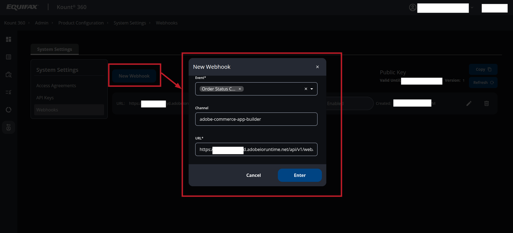

# Adobe Commerce Microservice with Kount Integration

## Table of Contents
- [Overview](#overview)
- [Prerequisites](#prerequisites)
    - [Create Adobe App Builder Project](#create-adobe-app-builder-project)
    - [Configure a New Integration in Adobe Commerce](#configure-a-new-integration-in-adobe-commerce)
    - [Install Commerce Eventing Module](#install-commerce-eventing-module)
- [Application Deployment and Onboarding](#application-deployment-and-onboarding)
    - [Configure the Project](#configure-the-project)
    - [Deploy the Application](#deploy-the-application)
    - [Onboarding](#onboarding)
    - [Event Subscription](#event-subscription)
- [Kount Configuration](#kount-configuration)
- [Adobe IMS Configuration](#adobe-ims-configuration)
- [Order Grid Updates](#order-grid-updates)
- [Additional Notes](#additional-notes)

---

## Overview

This project is a microservice integration built using the Adobe App Builder. It connects Adobe Commerce with Kount, a fraud prevention and detection platform. The service processes order placement events from Adobe Commerce and communicates with Kount to retrieve and display risk statuses in the order admin grid.

---

## Prerequisites

### Download and unpack App Builder package
1. Unpack app builder package to directory `./adobe-commerce-kount-app-builder-integration`*

2. Navigate to the project directory:
   ```bash
   cd adobe-commerce-kount-app-builder-integration
   ```

### Create Adobe App Builder Project
1. Create a new App Builder project in Adobe Developer Console:

Select the **App Builder** template during the project setup.


2. Add API "Adobe Commerce with Adobe ID".


On "Add a user authentication credential" screen choose "OAuth Web App"  click next button.


In "Default redirect URI" field insert adobe commerce base url, example "http://example.com/"


Click "Save"
Credentials needed to enable and configure Adobe IMS in Adobe Commerce

3. Add additional APIs to the project:
    - I/O Events
    - Adobe I/O Events for Adobe Commerce
    - API Mesh for Adobe Developer App Builder
    - I/O Management API
      

4. Download the workspace configuration:
- From your workspace **Overview** page in the App Builder project, download the configuration file and save it as:
  ```
  ./adobe-commerce-kount-app-builder-integration/Kount-{workspace}.json
  ```


### Configure a New Integration in Adobe Commerce  
1. In the Adobe Commerce Admin, navigate to **System > Extensions > Integrations**.
2. Click **Add New Integration**:
- Enter a name for the integration.
- On the left, select **API** and grant access to all resources.
  
  
3. Save the integration and activate it.
4. Note down the integration credentials (consumer key, consumer secret, access token, and access token secret).

### Install Commerce Eventing Module (only required when running Adobe Commerce versions 2.4.4 or 2.4.5) 
For Adobe Commerce versions 2.4.4 or 2.4.5, install the **Adobe I/O Events for Adobe Commerce** module following [this documentation](https://developer.adobe.com/commerce/extensibility/events/installation).

> **Note**: By upgrading the module to version 1.6.0 or greater, you will benefit from additional automated onboarding steps.

---

## Application Deployment and Onboarding

### Configure the Project
1. Navigate to the project directory:
   ```bash
   cd adobe-commerce-kount-app-builder-integration
   ```
2. Install npm dependencies:
   ```bash
   npm install
   ```
3. Connect to the Adobe App Builder:
   ```bash
   aio login
   aio console org select
   aio console project select
   aio console workspace select
   ```
4. Import workspace  configuration :
   ```bash
   aio app use Kount-{workspace}.json
   # this will create `.aio` and `.env` configuration files
   ```

5. Open `./adobe-commerce-kount-app-builder-integration/env.dist` file, copy all content and add to `./adobe-commerce-kount-app-builder-integration/.env`.

   Fill in the values in the .env file. The file describes where you can find the values for each environment variable.

### Deploy the Application
1. Deploy the project runtime actions:
   ```bash
   aio app deploy
   ```
2. Confirm deployment success in the Adobe Developer Console, under the **Runtime** section.
   

### Onboarding
1. Copy workspace configuration for onboarding:
```bash
   cp Kount-{workspace}.json scripts/onboarding/config/workspace.json
   #target filename must be exactly `workspace.json`.
   ```
2. Run the onboarding process:
   ```bash
   npm run onboard
   ```
3. Prepare and update `mesh.json`:
- Open `./adobe-commerce-kount-app-builder-integration/mesh.json`.
- Replace `{{RUNTIME_NAMESPACE}}` with App Builder runtime namespace name (can be found in `./adobe-commerce-kount-app-builder-integration/Kount-{workspace}.json` in `project.workspace.details.runtime.namespace.name` path).
  

4. Import or update the mesh:
   ```bash
   aio api-mesh create mesh.json
   # If mesh is already created:
   aio api-mesh update mesh.json
   ```

### Event Subscription
Subscribe to Adobe Commerce events:
```bash
npm run commerce-event-subscribe
```

---

## Kount Configuration
1. Login to Kount sandbox or live account.
2. Go to Admin -> Product Configuration  -> Api Keys and create  new api key for your App Builder app.
   
   

3. Add to `.env` file of the App Builder project the following variables and add your values here:

```
CANCEL_ORDER_ON_DECLINE=true|false # Defines whether an order should be automatically canceled (`true`) or remain active (`false`) when a DECLINE result received from Kount.

KOUNT_TOKEN_URL= # Kount token issuer url (see more details in .env.dist)
KOUNT_API_URL= # Kount API url  (see more details in .env.dist)
KOUNT_CLIENT_ID= # Kount API Client ID
KOUNT_API_KEY= # Kount API Key create in step 2
```
4. Webhook Configuration (optional).

4.1. Go to Admin -> Product Configuration  -> Webhooks and create  "New Webhook" configuration for your App Builder app.


`Event`: `Order Status Changes`

`Channel`: `[any name] (for example "adobe-commerce-app-builder")`

`URL`: `https://{{RUNTIME_NAMESPACE}}.adobeioruntime.net/api/v1/web/webhook/kount`
- Replace `{{RUNTIME_NAMESPACE}}` with App Builder runtime namespace name (can be found in `./adobe-commerce-kount-app-builder-integration/Kount-{workspace}.json` in `project.workspace.details.runtime.namespace.name` path).
  

4.2. Copy Kount webhook Public Key


and insert to `.env` file of the App Builder project for the following variable:
```
KOUNT_WEBHOOK_PUBLIC_KEY=
```
---

## Adobe IMS Configuration  
1. Enable Adobe IMS in Adobe Commerce:
   ```bash
   bin/magento admin:adobe-ims:enable
   ```
2. Use the credentials from **App Builder Project -> Workspace -> OAuth Web App**.
3. Log in to Adobe Commerce via Adobe IMS.

---

## Order Grid Updates
After integration, navigate to **Sales -> Orders** in Adobe Commerce Admin. Two new columns will be visible in the order grid:
- `Kount Status`
- `Kount Score`
  

---

## Additional Notes
- Ensure all settings in `.env` are configured before deploying the application.
- Follow the Adobe App Builder documentation if encountering errors during deployment.

---